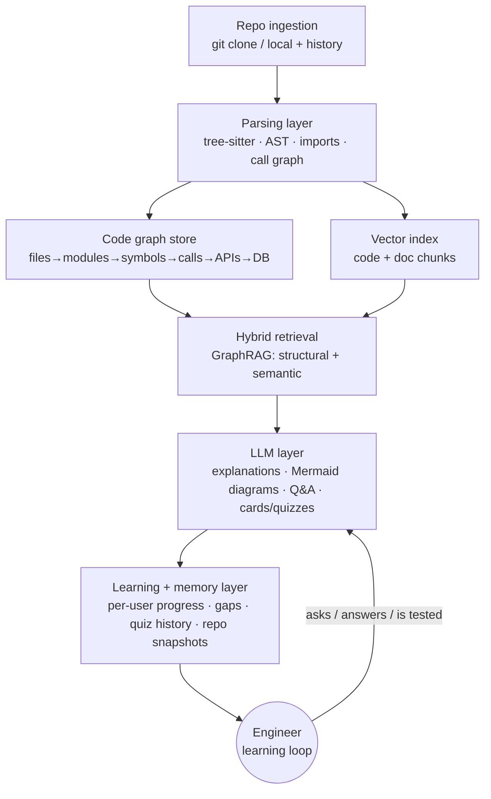

# KnowIT — Product Plan

*Draft v1 · 2026-05-29 · owner: Samrat*

## Thesis

KnowIT is the **learning and memory layer for codebases**. Existing tools help you *write* code (Cursor, Copilot) or *search and document* it (Sourcegraph Cody, DeepWiki, Greptile). Almost none help you actually **learn** a system, **test** whether you understand it, and **track** how your understanding — and the system itself — evolve over time. That gap is the wedge.

The v1 target is AI/ML engineers onboarding to or learning from ML codebases, where the pain is highest, the "why" matters most, and where your own expertise lets you build something credible.

Positioning in one line: **DeepWiki documents your repo. KnowIT teaches it to you — and remembers what you've learned.**

## Strategic context

The original vision treats "Repository Understanding" (Tier 1) as the must-have foundation. The market has moved: that layer is now largely commoditized and, for public repos, free. Building KnowIT's identity around it would mean competing head-on with well-funded incumbents on their strongest ground. The table below is the landscape as of May 2026.

| Tool | What it does | Implication for KnowIT |
|---|---|---|
| **DeepWiki** (Cognition/Devin) | Auto-generates wiki docs, architecture diagrams, dependency maps + a repo chat for *any* GitHub repo. Free for public repos, 50k+ indexed, ships an MCP server. | Tier 1 "understand the repo" is commoditized and free. Do **not** make it the headline. |
| **Greptile** (YC, ~$180M val) | Builds a full-repo semantic code graph; aimed at **AI code review** (~$30/dev/mo). | Adjacent tech, different job. Validates the graph approach; not a learning competitor. |
| **Cursor / Sourcegraph Cody / Claude Code / Copilot** | Strong RAG-over-repo "ask anything" + editing. | Understanding is their *substrate*, not their product. They don't teach. |
| **CodeSee** (now GitKraken) | Code visualization / maps. Still operating, small team. | Diagrams alone are not a moat. |

The under-served part of your vision is the rest of it: the **learning layer (Tier 2)**, the **engineering memory (Tier 3)**, and **tracking understanding and architecture over time (Tier 4)** — especially the "Learning Gaps" idea you flagged as your favorite. That is where KnowIT is differentiated and defensible. Understanding should be built as a *means to teach*, not as the product.

## The wedge

**"Teach Me This Repository," aimed first at ML codebases.**

Choose one beachhead and go deep: ML repositories — research code plus training / inference / data pipelines. They are the hardest codebases to understand, the most loaded with non-obvious design decisions ("why DETR, not YOLO?"), and they sit squarely in your domain.

The hook is not "explain this file" — everyone does that now. It is the **active-recall loop**: a generated learning path, then flashcards, quizzes at three levels, and interview mode, closed by a tracker that answers the two questions almost no tool asks: *"What have I never explored?"* and *"What am I using without understanding?"* KnowIT wins because it treats the engineer's understanding — not the code — as the thing to improve.

## Tier prioritization

The discipline here is saying no. The vision spans six tiers; v1 should ship two of them, and one of those only in lean form.

| Tier | Verdict | Rationale |
|---|---|---|
| **1 — Repo understanding** | v1 (lean) | Necessary substrate but commoditized. Build only what powers teaching: code graph, retrieval, per-file purpose/I-O/deps, one good architecture diagram, grounded "ask anything." Lean on existing indexers where possible. |
| **2 — Learning layer** | **v1 (the wedge)** | Learning path, flashcards, quizzes (3 levels), interview mode, learning-gaps tracker. Defer the audio overview to v1.5 — high wow, high effort. |
| **3 — Engineering intelligence** | v2 | Decision log + error KB need longitudinal use. Start with lightweight *manual* capture; automate later. |
| **4 — Change tracking** | v2 — but design for it in v1 | The "learning delta" is a genuine killer feature, but it needs stored baselines. Don't build the UI yet; make the data model snapshot-friendly now. |
| **5 — Research mode** | v3 | Adjacent and valuable, not the wedge. |
| **6 — Portfolio mode** | v3 / opportunistic | Cheap to layer on generated content; good for virality (blog/LinkedIn export). Not core. |

Explicitly cut from v1: audio overview, automated decision-log capture, the change-tracking UI, research mode, and portfolio mode.

## Roadmap

Efforts assume a small team (or solo + AI) and are relative sizing, not commitments.

| Phase | Goal | Key deliverables | Success signal |
|---|---|---|---|
| **0 — Spike / foundations** (2–3 wks) | Prove retrieval quality | Repo ingestion (clone/local + git history), tree-sitter parsing (Python first), code graph (files→modules→symbols→imports→calls), embeddings, hybrid retrieval | Accurate answers to ~10 architecture questions on 2 real ML repos |
| **1 — Understand, lean** (4–6 wks) | Table-stakes comprehension | File tree + import/dependency graph, per-file purpose/inputs/outputs/deps, one clean auto architecture diagram (Mermaid), grounded "ask anything" | A stranger correctly answers "how does inference flow?" using only KnowIT |
| **2 — Teach, the wedge** (4–6 wks) | The differentiated layer | Learning path from the graph, flashcards, quizzes (beginner/intermediate/senior), interview mode, **learning-gaps tracker** | Users complete a path and measurably improve quiz scores; "what haven't I explored" works |
| **3 — Track** (v2) | Co-evolution of code + understanding | Repo snapshots → changelog, architecture delta, **learning delta**; lightweight decision log + error KB | Returning user sees what changed *and* what they now need to re-learn |
| **4+** | Breadth | Audio overview, research mode, portfolio mode | — |

## MVP technical architecture

Keep it model-agnostic and local-first where feasible — privacy is a real differentiator, since engineers won't upload proprietary code to a cloud-only tool.

The layers, concretely:

**Ingestion** clones a repo or reads a local path and captures git history now (you'll need it for Tier 4 even though you won't use it yet). **Parsing** uses tree-sitter across languages, Python first, turning ASTs into symbols, imports, and call edges; Python import/dependency extraction can lean on `grimp`/`pydeps`-style tooling, with SCIP/LSIF indexers for precise cross-references later. **The graph store** holds the code graph — start embedded (Kùzu, or even NetworkX + SQLite) before standing up Neo4j. **Retrieval** is hybrid: a vector index over code and doc chunks combined with structural queries over the graph; that combination is what makes both explanations and quiz generation accurate and grounded. **The LLM layer** generates explanations, Mermaid diagrams, answers, and learning artifacts, with aggressive caching, incremental indexing, and cheap-model routing to control cost. **The memory layer** stores a per-repo knowledge base, per-user learning state (progress, gaps, quiz history), and repo snapshots.

The single most important design decision: **every generated artifact — explanation, flashcard, quiz question — should reference the graph node(s) and the git commit it was derived from.** That one choice is what later unlocks change tracking and learning deltas cheaply, instead of requiring a rewrite.

## Risks and open questions

The central risk is differentiation: understanding alone won't set KnowIT apart, so the learning loop has to be genuinely good — and the danger is that lean Tier 1 quietly expands to eat all the time. LLM cost at repo scale is real (large repos × per-file explanations × regeneration), which is why incremental indexing and caching are in Phase 0, not bolted on later. Auto-generated architecture diagrams are notoriously unreadable, so ship one diagram done well rather than five done poorly. Two decisions are still open and should be made early: **local-first vs. cloud** (local-first is a wedge against cloud-only incumbents but constrains model choice), and the **business model** — DeepWiki has anchored expectations at $0 for public repos, so the paid hook is almost certainly the learning-and-memory layer over private/team repos. Finally, "understanding" needs a credible proxy metric; quiz-score lift and gap coverage are the most defensible candidates.

## Success metrics (v1)

Time-to-understanding (minutes for a new dev to correctly answer N architecture questions), groundedness/accuracy of "ask anything" answers (human-rated), learning engagement (path completion and quiz-score lift across attempts), and gap coverage (the share of a repo's key concepts the user has actually been tested on).

## Immediate next steps

1. Confirm the beachhead (ML repos) and decide local-first vs. cloud for v1.
2. Pick two real ML repos as design partners / test corpus (e.g., a DETR implementation + a training pipeline).
3. Approve the scope above; then scaffold Phase 0 — ingestion + tree-sitter code graph + a retrieval spike.
